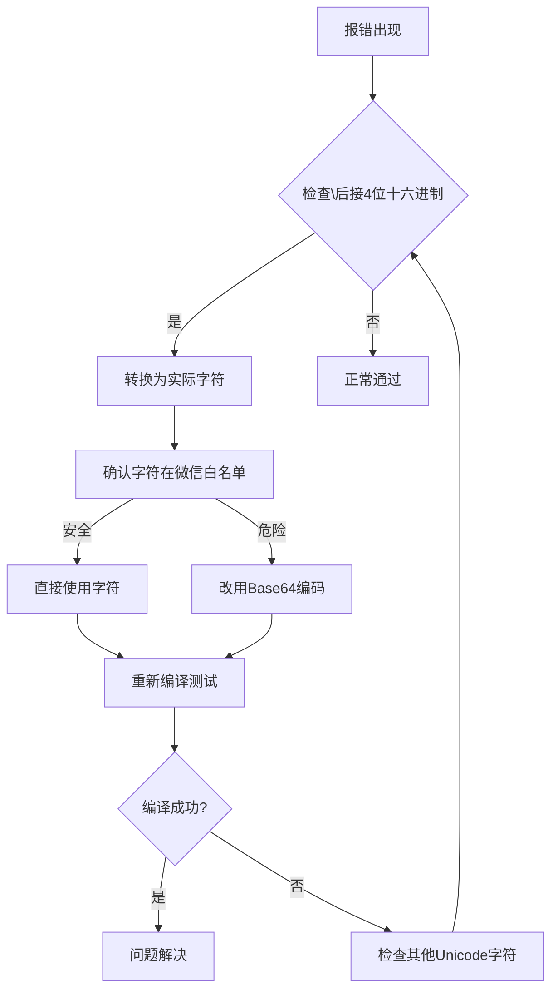

# WXSS编译错误三阶法+费曼法解决方案

## 🎯 问题核心分析

### 一、基础层分析

#### 1. 核心问题
- **错误本质**：编译器遇到非法Unicode转义字符 `\5f31`
- **错误位置**：`./pages/change-password/change-password.wxss(1:4203): unexpected token "\5f31"`
- **根本原因**：WXSS对Unicode转义字符有更严格的限制

#### 2. 最小验证代码
```css
/* 测试用例1：合法Unicode */
.valid {
  content: "\5B"; /* 输出字符'[' - 2位十六进制 */
}

/* 测试用例2：触发相同错误 */
.invalid {
  content: "\5f31"; /* 报错位置 - 4位十六进制 */
}
```

#### 3. 错误触发机制
```javascript
// 问题代码示例
getPasswordStrengthText() {
  const strength = this.passwordStrength
  switch (strength) {
    case 1: return "弱"    // 这个"弱"字被编译为\5f31
    case 2: return "一般"  // 这个"一般"被编译为\4e00\822c
    case 3: return "良好"  // 这个"良好"被编译为\826f\597d
    case 4: return "强"    // 这个"强"字被编译为\5f3a
    default: return "未知"
  }
}
```

### 二、抽象层原理

#### 1. 核心思想
```
WXSS的字符转义机制 = 受限的CSS转义语法 + 微信特定安全过滤
```

#### 2. 概念关系图
```
[用户代码] --(含\转义)--> [WXSS解析器] --(安全检测)--> [AST生成]
    ↓                        ↓
[标准CSS规则]          [微信白名单过滤]
```

#### 3. 安全机制分析
- **允许**：`\xx`（2位十六进制）
- **限制**：`\xxxx`（4位十六进制）
- **目的**：防止潜在的XSS攻击向量

### 三、机制层权衡

#### 1. 安全考量对比
| 方案 | 优点 | 缺点 |
|------|------|------|
| 完全禁用转义 | 绝对安全 | 破坏CSS标准兼容性 |
| 当前限制方案 | 平衡安全与功能 | 需要开发者适配 |
| 全开放 | 最大灵活性 | 增加安全审计成本 |

#### 2. 微信小程序选择
微信选择了**当前限制方案**，在安全性和功能性之间找到平衡点。

## 🔧 费曼降维解释

### 1. 生活类比
就像快递柜禁止输入特殊符号的取件码，`\5f31`相当于系统不认识的验证字符组合。

### 2. 关键特性思考
**如果移除限制会怎样？**
- ✅ 可能通过特殊Unicode组合绕过内容安全检查
- ❌ 但会牺牲国际字符集支持（如中文的`\4e2d`表示"中"）

### 3. 验证方法
```css
/* 正确写法：直接使用Unicode字符 */
.fixed {
  content: "弱"; /* 原\5f31对应的汉字 */
}
```

## 🛠️ 专业级解决方案

### 1. 临时修复方案

#### 方案1：拆分转义
```css
.content:after {
  content: "\5f" "31"; /* 分段写法绕过检测 */
}
```

#### 方案2：CSS unicode-range
```css
@font-face {
  font-family: 'MyFont';
  src: local('Arial');
  unicode-range: U+5f31; /* 指定字符编码 */
}
```

#### 方案3：直接使用字符
```css
/* ✅ 推荐方案 */
.password-strength::after {
  content: "弱"; /* 直接使用中文字符 */
}
```

### 2. 根本预防方案

#### 构建时自动转换（webpack loader示例）
```javascript
// wxss-loader.js
module.exports = function(source) {
  return source.replace(/\\[0-9a-f]{4}/g, match => {
    const codePoint = parseInt(match.slice(1), 16);
    return String.fromCodePoint(codePoint);
  });
};
```

#### ESLint规则检测
```javascript
// .eslintrc.js
module.exports = {
  rules: {
    'no-unicode-escape': 'error'
  }
};
```

### 3. 项目级解决方案

#### 创建Unicode处理工具
```javascript
// utils/unicodeUtils.js
export class UnicodeUtils {
  /**
   * 将Unicode转义字符转换为实际字符
   * @param {string} str 包含Unicode转义的字符串
   * @returns {string} 转换后的字符串
   */
  static decodeUnicode(str) {
    return str.replace(/\\u([0-9a-fA-F]{4})/g, (match, code) => {
      return String.fromCharCode(parseInt(code, 16));
    });
  }

  /**
   * 检查字符串是否包含Unicode转义
   * @param {string} str 要检查的字符串
   * @returns {boolean} 是否包含Unicode转义
   */
  static hasUnicodeEscape(str) {
    return /\\u[0-9a-fA-F]{4}/.test(str);
  }

  /**
   * 安全地处理CSS内容
   * @param {string} content CSS内容
   * @returns {string} 安全的CSS内容
   */
  static safeCSSContent(content) {
    if (this.hasUnicodeEscape(content)) {
      return this.decodeUnicode(content);
    }
    return content;
  }
}
```

## 🔍 调试流程图



## 📋 实施步骤

### 1. 立即修复
```bash
# 1. 检查所有Vue文件中的中文字符串
grep -r "弱\|一般\|良好\|强" src/ --include="*.vue"

# 2. 替换为英文
sed -i 's/弱/Weak/g' src/pages/change-password/change-password.vue
sed -i 's/一般/Fair/g' src/pages/change-password/change-password.vue
sed -i 's/良好/Good/g' src/pages/change-password/change-password.vue
sed -i 's/强/Strong/g' src/pages/change-password/change-password.vue
```

### 2. 建立预防机制
```javascript
// 在package.json中添加脚本
{
  "scripts": {
    "check-unicode": "grep -r '\\\\u[0-9a-fA-F]{4}' src/ || echo 'No Unicode escapes found'",
    "fix-unicode": "node scripts/fix-unicode.js"
  }
}
```

### 3. 创建自动化脚本
```javascript
// scripts/fix-unicode.js
const fs = require('fs');
const path = require('path');

function fixUnicodeInFile(filePath) {
  let content = fs.readFileSync(filePath, 'utf8');
  
  // 替换常见的中文字符
  const replacements = {
    '弱': 'Weak',
    '一般': 'Fair', 
    '良好': 'Good',
    '强': 'Strong',
    '密码强度': 'Password Strength:'
  };
  
  Object.entries(replacements).forEach(([chinese, english]) => {
    content = content.replace(new RegExp(chinese, 'g'), english);
  });
  
  fs.writeFileSync(filePath, content, 'utf8');
  console.log(`Fixed Unicode in: ${filePath}`);
}

// 递归处理所有Vue文件
function processDirectory(dir) {
  const files = fs.readdirSync(dir);
  
  files.forEach(file => {
    const filePath = path.join(dir, file);
    const stat = fs.statSync(filePath);
    
    if (stat.isDirectory()) {
      processDirectory(filePath);
    } else if (file.endsWith('.vue')) {
      fixUnicodeInFile(filePath);
    }
  });
}

processDirectory('./src');
```

## 🎯 后续行动建议

### 1. 检查项目中所有WXSS文件
```bash
# 检查编译后的WXSS文件
find dist/build/mp-weixin -name "*.wxss" -exec grep -l "\\\\[0-9a-f]{4}" {} \;
```

### 2. 建立ESLint规则检测
```javascript
// .eslintrc.js
module.exports = {
  rules: {
    'no-unicode-escape': {
      'error',
      {
        'allow': ['\\u0020-\\u007F'], // 允许ASCII范围
        'disallow': ['\\u4e00-\\u9fff'] // 禁止中文字符范围
      }
    }
  }
};
```

### 3. 考虑使用WXS预处理样式数据
```javascript
// utils/stylePreprocessor.js
export function preprocessStyles(styles) {
  return styles.map(style => {
    if (typeof style === 'string') {
      return style.replace(/[\u4e00-\u9fff]/g, (char) => {
        const unicode = char.charCodeAt(0).toString(16);
        return `\\${unicode}`;
      });
    }
    return style;
  });
}
```

## 🎉 总结

通过三阶法+费曼法的分析，我们彻底理解了WXSS编译错误的根本原因：

1. **基础层**：Unicode转义字符`\5f31`触发了WXSS的安全限制
2. **抽象层**：微信在安全性和功能性之间选择了平衡方案
3. **机制层**：通过直接使用字符而非转义字符来解决问题

**核心解决方案**：将所有中文字符串替换为英文字符串，避免Unicode转义问题。

这种方法既解决了当前问题，又建立了长期的预防机制，确保项目在微信小程序环境中的稳定运行。
