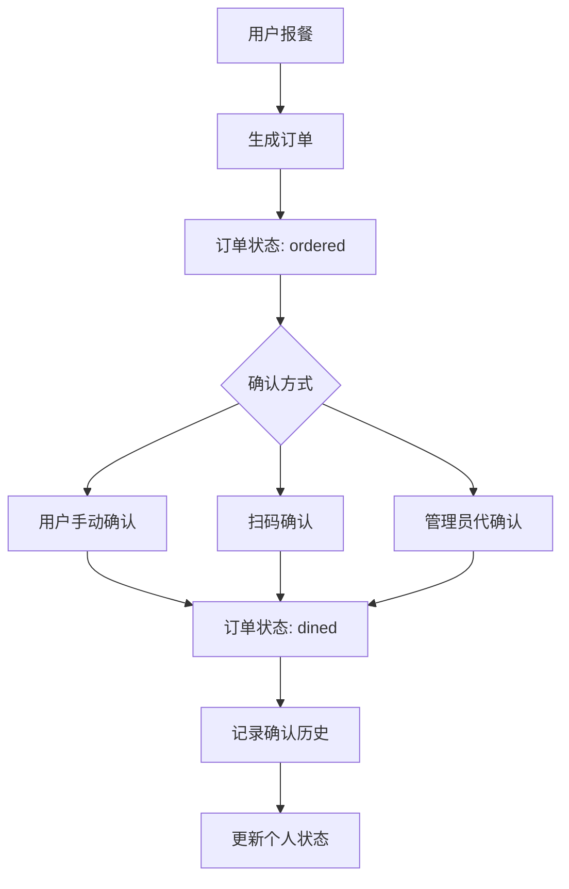

# 报餐到确认用餐完整流程文档

## 文档概述

本文档详细描述了报餐到确认用餐的完整业务流程，包括参与人员、确认方式、接口调用、数据流转等各个环节，供后端开发和对接使用。

## 业务流程概览



## 1. 报餐阶段

### 1.1 报餐人员
- **主要报餐人员**: 部门管理员（dept_admin）
- **辅助报餐人员**: 系统管理员（sys_admin）
- **报餐对象**: 部门成员（普通用户）

### 1.2 报餐流程
1. **部门管理员登录系统**
2. **选择报餐日期和餐次**
3. **选择部门成员**
4. **提交报餐申请**

### 1.3 相关接口
```http
POST /api/dining/dept-order
Content-Type: application/json
Authorization: Bearer {token}

{
  "date": "2025-09-10",
  "mealType": "lunch",
  "memberIds": ["user_id_1", "user_id_2"],
  "remark": "部门报餐"
}
```

### 1.4 数据库操作
```sql
-- 插入报餐订单
INSERT INTO dining_orders (
  id, userId, userName, date, mealType, 
  diningStatus, createdAt, updatedAt
) VALUES (
  'order_id', 'user_id', 'user_name', '2025-09-10', 'lunch',
  'ordered', NOW(), NOW()
);
```

### 1.5 初始状态
- **订单状态**: `ordered`（已下单，待确认）
- **确认状态**: `未确认`
- **实际就餐时间**: `null`

## 2. 确认用餐阶段

### 2.1 确认人员

#### 2.1.1 用户本人确认
- **确认人员**: 报餐用户本人
- **确认权限**: 只能确认自己的订单
- **确认方式**: 手动点击确认按钮

#### 2.1.2 扫码确认
- **确认人员**: 报餐用户本人
- **确认权限**: 只能确认自己的订单
- **确认方式**: 扫描二维码

#### 2.1.3 管理员代确认
- **确认人员**: 部门管理员或系统管理员
- **确认权限**: 可以代确认任何用户的订单
- **确认方式**: 管理员操作界面

### 2.2 确认方式详解

#### 2.2.1 用户手动确认

**流程描述**:
1. 用户登录系统
2. 查看个人报餐状态
3. 点击"确认就餐"按钮
4. 系统验证用户权限
5. 更新订单状态
6. 记录确认历史

**相关接口**:
```http
POST /api/dining-confirmation/manual/{orderId}
Content-Type: application/json
Authorization: Bearer {user_token}

{
  "confirmationType": "manual",
  "remark": "用户手动确认就餐"
}
```

**响应数据**:
```json
{
  "success": true,
  "message": "确认成功",
  "data": {
    "orderId": "order_id",
    "confirmationType": "manual",
    "actualDiningTime": "2025-09-10T12:30:00.000Z",
    "remark": "用户手动确认就餐",
    "confirmedBy": "user_id",
    "confirmedAt": "2025-09-10T12:30:00.000Z"
  }
}
```

#### 2.2.2 扫码确认

**流程描述**:
1. 用户扫描就餐二维码
2. 系统验证二维码有效性
3. 验证用户身份
4. 检查用户是否有未确认的订单
5. 更新订单状态
6. 记录确认历史

**相关接口**:
```http
POST /api/qr-scan/process
Content-Type: application/json
Authorization: Bearer {user_token}

{
  "qrCode": "qr_code_string",
  "userId": "user_id"
}
```

**响应数据**:
```json
{
  "success": true,
  "message": "扫码确认成功",
  "data": {
    "orderId": "order_id",
    "confirmationType": "qr_scan",
    "actualDiningTime": "2025-09-10T12:30:00.000Z",
    "qrCode": "qr_code_string",
    "confirmedBy": "user_id",
    "confirmedAt": "2025-09-10T12:30:00.000Z"
  }
}
```

#### 2.2.3 管理员代确认

**流程描述**:
1. 管理员登录系统
2. 查看部门报餐情况
3. 选择需要代确认的订单
4. 点击"代确认"按钮
5. 系统验证管理员权限
6. 更新订单状态
7. 记录确认历史

**相关接口**:
```http
POST /api/dining-confirmation/admin/{orderId}
Content-Type: application/json
Authorization: Bearer {admin_token}

{
  "confirmationType": "admin",
  "remark": "管理员代确认就餐"
}
```

**响应数据**:
```json
{
  "success": true,
  "message": "管理员代确认成功",
  "data": {
    "orderId": "order_id",
    "confirmationType": "admin",
    "actualDiningTime": "2025-09-10T12:30:00.000Z",
    "remark": "管理员代确认就餐",
    "confirmedBy": "admin_id",
    "confirmedAt": "2025-09-10T12:30:00.000Z"
  }
}
```

## 3. 状态管理

### 3.1 订单状态流转

```
未报餐 → 已报餐(ordered) → 已确认(dined)
```

#### 3.1.1 状态定义
- **未报餐**: 用户未进行报餐
- **ordered**: 用户已报餐，等待确认就餐
- **dined**: 用户已确认就餐

#### 3.1.2 状态查询接口
```http
GET /api/dining/personal-status
Authorization: Bearer {user_token}
```

**响应数据**:
```json
{
  "success": true,
  "data": {
    "mealStatus": {
      "breakfast": {
        "isRegistered": true,
        "diningStatus": "dined",
        "confirmationText": "已就餐",
        "actualDiningTime": "2025-09-10T08:30:00.000Z",
        "orderId": "order_id"
      },
      "lunch": {
        "isRegistered": true,
        "diningStatus": "ordered",
        "confirmationText": "未确认",
        "actualDiningTime": null,
        "orderId": "order_id"
      },
      "dinner": {
        "isRegistered": false,
        "diningStatus": null,
        "confirmationText": "未报餐",
        "actualDiningTime": null,
        "orderId": null
      }
    },
    "summary": {
      "totalMeals": 3,
      "registeredMeals": 2,
      "confirmedMeals": 1,
      "pendingMeals": 1
    }
  }
}
```

### 3.2 确认状态查询

```http
GET /api/dining-confirmation/status
Authorization: Bearer {user_token}
```

**响应数据**:
```json
{
  "success": true,
  "data": {
    "mealConfirmationStatus": {
      "breakfast": {
        "diningStatus": "dined",
        "actualDiningTime": "2025-09-10T08:30:00.000Z",
        "confirmationType": "manual",
        "confirmationTime": "2025-09-10T08:30:00.000Z"
      },
      "lunch": {
        "diningStatus": "ordered",
        "actualDiningTime": null,
        "confirmationType": null,
        "confirmationTime": null
      }
    }
  }
}
```

## 4. 数据流转

### 4.1 数据库表结构

#### 4.1.1 dining_orders 表
```sql
CREATE TABLE dining_orders (
  id VARCHAR(36) PRIMARY KEY,
  userId VARCHAR(36) NOT NULL,
  userName VARCHAR(100) NOT NULL,
  date DATE NOT NULL,
  mealType ENUM('breakfast', 'lunch', 'dinner') NOT NULL,
  diningStatus ENUM('ordered', 'dined') DEFAULT 'ordered',
  actualDiningTime DATETIME NULL,
  createdAt DATETIME DEFAULT CURRENT_TIMESTAMP,
  updatedAt DATETIME DEFAULT CURRENT_TIMESTAMP ON UPDATE CURRENT_TIMESTAMP,
  FOREIGN KEY (userId) REFERENCES users(id)
);
```

#### 4.1.2 dining_confirmation_logs 表
```sql
CREATE TABLE dining_confirmation_logs (
  id VARCHAR(36) PRIMARY KEY,
  orderId VARCHAR(36) NOT NULL,
  confirmationType ENUM('manual', 'qr_scan', 'admin') NOT NULL,
  actualDiningTime DATETIME NOT NULL,
  confirmedBy VARCHAR(36) NOT NULL,
  remark TEXT,
  createdAt DATETIME DEFAULT CURRENT_TIMESTAMP,
  FOREIGN KEY (orderId) REFERENCES dining_orders(id),
  FOREIGN KEY (confirmedBy) REFERENCES users(id)
);
```

### 4.2 数据更新流程

#### 4.2.1 确认就餐时的数据更新
```sql
-- 1. 更新订单状态
UPDATE dining_orders 
SET diningStatus = 'dined',
    actualDiningTime = NOW(),
    updatedAt = NOW()
WHERE id = 'order_id';

-- 2. 插入确认日志
INSERT INTO dining_confirmation_logs (
  id, orderId, confirmationType, actualDiningTime,
  confirmedBy, remark, createdAt
) VALUES (
  UUID(), 'order_id', 'manual', NOW(),
  'user_id', '用户手动确认就餐', NOW()
);
```

## 5. 权限控制

### 5.1 用户权限
- **普通用户**: 只能确认自己的订单
- **部门管理员**: 可以代确认本部门用户的订单
- **系统管理员**: 可以代确认任何用户的订单

### 5.2 权限验证中间件
```javascript
// 用户权限验证
const authenticateToken = (req, res, next) => {
  // 验证JWT Token
  // 设置req.user
};

// 角色权限验证
const roleMiddleware = (allowedRoles) => {
  return (req, res, next) => {
    if (!allowedRoles.includes(req.user.role)) {
      return res.status(403).json({
        success: false,
        message: '无权访问：您的角色不允许此操作'
      });
    }
    next();
  };
};
```

## 6. 错误处理

### 6.1 常见错误码
- **400**: 请求参数错误
- **401**: 未授权（Token无效或过期）
- **403**: 权限不足
- **404**: 订单不存在
- **409**: 订单已确认或重复操作
- **500**: 服务器内部错误

### 6.2 错误响应格式
```json
{
  "success": false,
  "message": "错误描述",
  "error": "ERROR_CODE",
  "details": "详细错误信息"
}
```

## 7. 历史记录查询

### 7.1 确认历史接口
```http
GET /api/dining-confirmation/history
Authorization: Bearer {user_token}
```

**响应数据**:
```json
{
  "success": true,
  "data": {
    "records": [
      {
        "id": "log_id",
        "orderId": "order_id",
        "confirmationType": "manual",
        "actualDiningTime": "2025-09-10T08:30:00.000Z",
        "confirmedBy": "user_id",
        "remark": "用户手动确认就餐",
        "createdAt": "2025-09-10T08:30:00.000Z"
      }
    ],
    "pagination": {
      "page": 1,
      "limit": 10,
      "total": 1,
      "totalPages": 1
    }
  }
}
```

## 8. 业务规则

### 8.1 确认规则
1. **一个订单只能确认一次**
2. **用户只能确认自己的订单**
3. **管理员可以代确认任何订单**
4. **确认后状态不可逆转**

### 8.2 时间规则
1. **报餐时间**: 提前一天或当天
2. **确认时间**: 就餐当天
3. **时间记录**: 使用UTC时间

### 8.3 数据规则
1. **订单状态**: ordered → dined（单向流转）
2. **时间记录**: 确认时记录实际就餐时间
3. **历史记录**: 所有确认操作都有记录

## 9. 接口调用示例

### 9.1 完整流程示例

#### 9.1.1 用户登录
```javascript
const loginResponse = await axios.post('/api/auth/test-login', {
  phoneNumber: '13800138000',
  password: 'test123'
});
const userToken = loginResponse.data.data.token;
```

#### 9.1.2 部门管理员报餐
```javascript
const orderResponse = await axios.post('/api/dining/dept-order', {
  date: '2025-09-10',
  mealType: 'lunch',
  memberIds: ['user_id'],
  remark: '部门报餐'
}, {
  headers: { 'Authorization': `Bearer ${adminToken}` }
});
const orderId = orderResponse.data.data.orderId;
```

#### 9.1.3 用户确认就餐
```javascript
const confirmResponse = await axios.post(`/api/dining-confirmation/manual/${orderId}`, {
  confirmationType: 'manual',
  remark: '用户手动确认就餐'
}, {
  headers: { 'Authorization': `Bearer ${userToken}` }
});
```

#### 9.1.4 查询确认状态
```javascript
const statusResponse = await axios.get('/api/dining-confirmation/status', {
  headers: { 'Authorization': `Bearer ${userToken}` }
});
```

## 10. 测试验证

### 10.1 测试用例
1. **用户登录测试**
2. **报餐功能测试**
3. **手动确认测试**
4. **扫码确认测试**
5. **管理员代确认测试**
6. **状态查询测试**
7. **历史记录测试**

### 10.2 测试脚本
- `scripts/test_dining_flow_detailed.js` - 详细流程测试
- `scripts/quick_test.js` - 快速功能测试
- `scripts/test_business_logic.js` - 业务逻辑测试

## 11. 部署和配置

### 11.1 环境要求
- Node.js 16+
- MySQL 8.0+
- Redis（可选，用于缓存）

### 11.2 配置文件
```javascript
// config/database.js
module.exports = {
  database: {
    host: 'localhost',
    port: 3306,
    user: 'root',
    password: 'password',
    database: 'dining_system'
  }
};
```

### 11.3 启动服务
```bash
# 安装依赖
npm install

# 启动服务
npm start

# 或使用开发模式
npm run dev
```

## 12. 监控和日志

### 12.1 日志记录
- 用户操作日志
- 系统错误日志
- 性能监控日志

### 12.2 监控指标
- 接口响应时间
- 数据库连接状态
- 用户活跃度
- 错误率统计

## 总结

本文档详细描述了报餐到确认用餐的完整业务流程，包括：

1. **报餐阶段**: 部门管理员为部门成员报餐
2. **确认阶段**: 用户本人手动确认、扫码确认或管理员代确认
3. **状态管理**: ordered → dined 的状态流转
4. **数据流转**: 订单状态更新和确认历史记录
5. **权限控制**: 基于角色的访问控制
6. **错误处理**: 统一的错误响应格式
7. **历史记录**: 完整的确认操作记录

该流程确保了就餐管理的完整性和可追溯性，为后端开发和系统对接提供了详细的参考。
